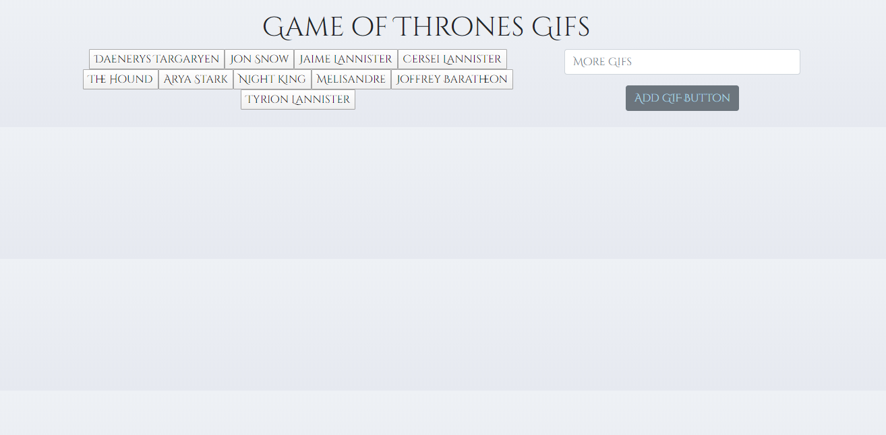
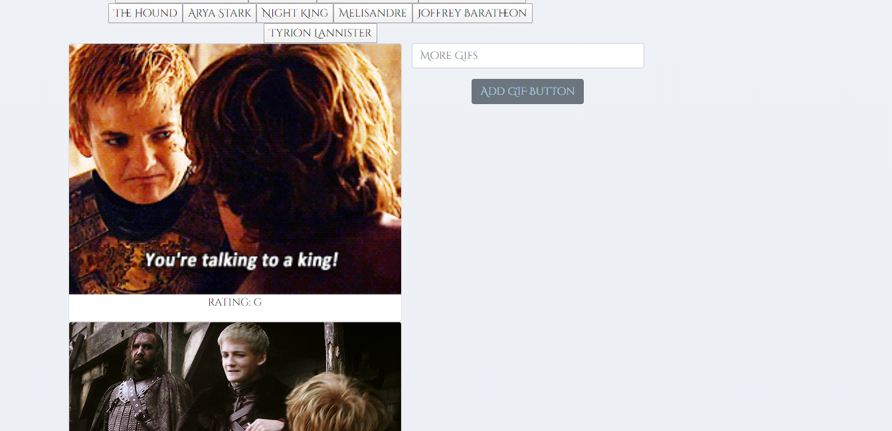
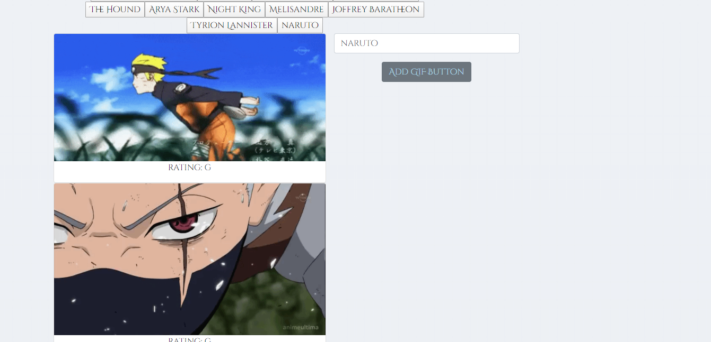

# GifTastic-Assignment

# Live Page
https://davidmstanleyjr.github.io/GifTastic-Assignment-GH-Pages/

# Description

This assignment allows me to demonstrate my proficiency with AJAX and Jquery. I created an API key and used it to populate my page with Game of Thrones related gifs. I love Game of Thrones and the theme made this challenging homework assignment a little more enjoyable!

# Issues

The only issue I had was getting the GIFS to animate and then become still after clicking. All I did to solve this was go back to the activities and figure out the code to accomplish this.

# Screenshots

